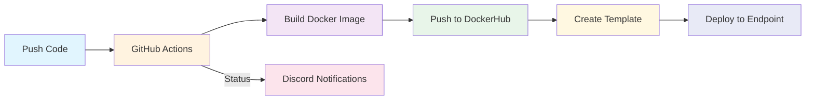

# Quickstart Guide for New Team Members at Hooked (behooked.co)

Welcome to the Hooked team! This guide will help you set up your development environment and understand our CI/CD workflow. For any DevOps assistance, please contact Nikhil Mishra.

## 1. GitHub Setup

### Repository Access
1. Add your SSH key to the `devshooked` GitHub account
2. Set up your passkey for authentication
3. If you need a new repository:
   - Create it under the `devshooked` github account
   - Add yourself as a collaborator

## 2. AWS Account Setup

1. Request an IAM user for the devshooked AWS account from Nikhil Mishra
2. After receiving credentials:
   - Sign in to AWS Console
   - Set up Multi-Factor Authentication (MFA)

## 3. Docker Configuration

For Dockerfile or Docker Compose setup:
1. Share your repository with the `.env` file on Discord
2. Contact Nikhil for Docker configuration assistance and proceed with cicd-stuff

## 4. Cloud Infrastructure

We utilize multiple cloud providers:
- AWS (Primary)
- Azure
- GCP

## 5. CI/CD Workflow

### Our CI/CD Pipeline


### Deployment Process
```mermaid
sequenceDiagram
    participant Dev as Developer
    participant Git as GitHub
    participant CI as GitHub Actions
    participant DH as DockerHub
    participant End as Endpoint
    participant Disc as Discord
    
    Dev->>Git: 1. Push Code
    Git->>CI: 2. Trigger Actions
    CI->>Disc: 3. Build Started
    CI->>DH: 4. Push Image
    Note over DH: Image: gethooked/[app-name]
    CI->>Disc: 5. Build Complete
    Dev->>End: 6. Create Template
    Note over End: Configure:<br/>- Image<br/>- Registry Creds<br/>- Env Variables
    Dev->>End: 7. Deploy
    End->>Disc: 8. Deployment Status
```

### Step 1: Dockerfile Creation
- Create a Dockerfile in your repository
- This will be built using GitHub Actions

### Step 2: GitHub Actions Integration
- CI/CD configuration file in your repository triggers the build process
- Built Docker image is pushed to our Docker Hub repository (`gethooked`)
- Access Docker Hub using the devshooked Google account credentials

### Step 3: Build Notifications
- Build status and other details are sent to the `build-notifications` channel on Discord
- Notifications are handled via Discord webhook

### Step 4: Secrets Management
1. Store `.env` secrets in two locations:
   - GitHub secrets (for GitHub Actions)
   - Runpod secrets

### Step 5: Template Creation
After successful build and push:
1. Create a template with:
   - Image name
   - Registry credentials
   - Environment variable secrets

### Step 6: Deployment
- Use the created template in your endpoint
- Configure according to your requirements

## Need Help?

For any DevOps-related assistance or questions, contact Nikhil Mishra.

---
